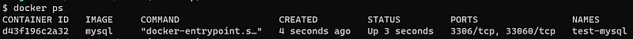

# Python Pytest Unit Testing Examples

This Python PyTest Unit Testing examples repro uses Python 3 and MySQL

It will demonstrate some examples of how to unit test your Python classes and how to perform some basic unit testing of database operations against a MySQL database.

## Why Pytest?

Pytest is a “core test framework.” It is a Python package that lets people write test cases as functions. It also executes those tests and then reports results. In that sense, pytest is similar to other test frameworks like Java's JUnit, C#’s NUnit, and JavaScript's Mocha.

## Requirements

* Python 3
* pip3
* pytest
* mysql-connector-python

Check if Python is installed by entering the following command in a terminal:

```
python --version
```

You should see the proper version printed. If the Python command doesn't work or doesn't print the expected version number, then try using python3 instead:

```
python3 --version
```
If that still doesn’t work, then you need to install Python.

Once Python is installed you will need to install the following third-party pacakges:

```
pip3 install mysql-connector-python pytest
```


## Database target

I'm using MySQL 8.2 as a target for my database unit tests.

MySQL will be hosted inside a Docker container. 

Download the official MySQL Docker ima

`docker pull mysql:latest`

or you may specify a specific version: 

`docker pull mysql:8.2`


## Running and Managing a MySQL Server Container

Create the container from the mysql image using the command:

`$ docker run --name test-mysql -e MYSQL_ROOT_PASSWORD=strong_password -d mysql`

* `run`: creates a new container or starts an existing one

* `--name CONTAINER_NAME`: gives the container a name. The name should be readable and short. In our case, the name is test-mysql.

* `-e ENV_VARIABLE=value`: the -e tag creates an environment variable that will be accessible within the container. It is crucial to set `MYSQL_ROOT_PASSWORD` so that we can run SQL commands later from the container. Make sure to store your strong password somewhere safe (not your brain).

* `-d`: short for detached, the -d tag makes the container run in the background. If you remove this tag, the command will keep printing logs until the container stops.

* `image_name`: the final argument is the image name the container will be built from. In this case, our image is `mysql`.

Check the container status using the command:  `docker ps`  



To access the terminal inside your contain use the command:

`$ docker exec -it container_name bash`

This will launch a bash session


## Connecting to the MySQL Server Container Locally

To connect to the server, containers also come with a MySQL client that lets us run SQL queries. 

1. Open the bash terminal of test-mysql:

`$ docker exec -it test-mysql bash`

2. Connect to the client as a root user:

```$ mysql -u root -p
Enter password: ...
mysql>
```
Where the `-u` tag to specify the username (root) and adding the `-p` tag to enter the password when prompted.

## Connecting to the MySQL Server Container Remotely

Restart the container by mapping a port from the container to a port on our local machine:

`$ docker run -d --name test-mysql -e MYSQL_ROOT_PASSWORD=strong_password -p 3307:3306 mysql`


This command does the following:

* `-p 3307:3306`: Maps the container's port 3306 (the default port for MySQL) to your local port 3307. This means any traffic sent to your local port 3307 will be forwarded to the container's port 3306 and your MySQL server will be accessible on that port.

* `-d`: Runs the container in detached mode again.

* `--name test-mysql`: Reuses the same container name "test-mysql".

* `-e MYSQL_ROOT_PASSWORD=strong_password`: Sets the root password again for the MySQL server.

* `mysql`: Specifies the Docker image to run, which is the official MySQL image.

After terminal outputs a new ID for the container, we can check the port mappings:

```
$ docker port test-mysql
3306/tcp -> 0.0.0.0:3307
```